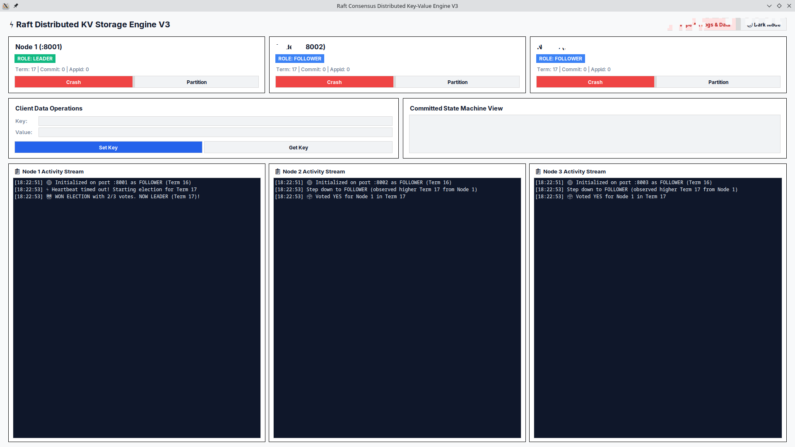
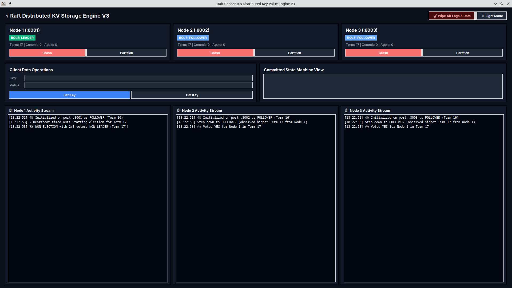
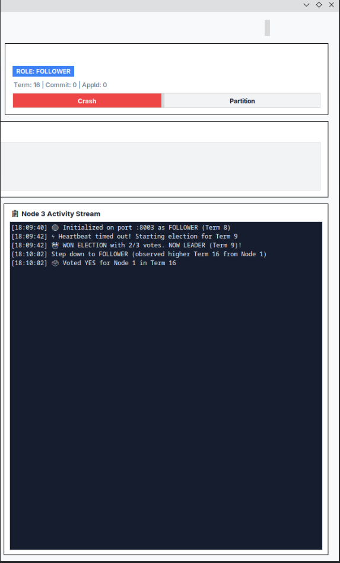
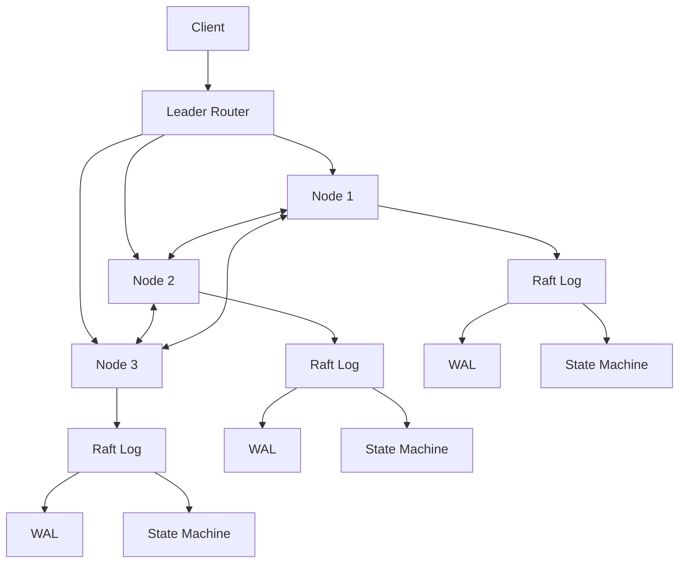

<div align="center">

# ⚡ Raft KV V3

### A fault-tolerant distributed Key-Value Store built from scratch in Python

<p>
  
  
  
  
  
  
</p>

<p>
  <strong>Three independent nodes • Leader election • Replicated logs • Quorum commits • Crash recovery • Network partitions</strong>
</p>

<p>
  <a href="#-overview">Overview</a> •
  <a href="#-architecture">Architecture</a> •
  <a href="#-raft-flow">Raft Flow</a> •
  <a href="#-fault-tolerance">Fault Tolerance</a> •
  <a href="#-testing">Testing</a> •
  <a href="#-run-it">Run It</a>
</p>

</div>

---

## 🖥️ Dashboard

The project includes a live cluster dashboard showing node roles, terms, commit/apply state, key-value state, and per-node activity streams.

### Light Mode



### Dark Mode



### Single-Node View



> **The UI is only the visualization layer.** The interesting part of this project is the distributed backend underneath it.

---

## 🧠 Overview

**Raft KV V3** is a distributed, fault-tolerant Key-Value Store implemented using Python's standard library.

The system runs a small cluster of independent nodes communicating over **raw TCP sockets**. A Raft-style consensus engine elects a leader, replicates commands through the cluster, commits entries only after the required quorum is reached, and reconstructs persistent state after node failure.

The project was intentionally built **without Redis, a database engine, a Raft library, or an external networking framework**.

The goal is not to compete with production databases.

The goal is to understand and implement the difficult engineering ideas underneath them:

```text
Networking
    ↓
Concurrency
    ↓
Consensus
    ↓
Replication
    ↓
Durability
    ↓
Recovery
    ↓
Failure Testing
```

---

## ✨ What It Demonstrates

| Area | Implementation |
|---|---|
| 🌐 Networking | Raw TCP sockets + custom message framing |
| 🧵 Concurrency | Python threads + synchronization primitives |
| 🗳️ Consensus | Raft leader election and term management |
| 📚 Replication | Leader-driven log replication |
| 🔒 Safety | Majority/quorum-based commitment |
| 💾 Durability | Append-only Write-Ahead Log |
| ♻️ Recovery | WAL + persistent node metadata reconstruction |
| 🧩 State Machine | Committed log entries applied separately |
| 💥 Fault Injection | Node crashes, restarts, partitions and message failures |
| 🧪 Testing | Automated failure/chaos scenarios |
| 📊 Observability | Node event streams, cluster state and metrics |
| 🧱 Architecture | Separate protocol, storage, Raft and state-machine layers |

---

# 🏗️ Architecture



Each node is an independent process/threaded server with its own:

- Raft state
- replicated log
- persistent metadata
- WAL
- state machine
- TCP networking
- failure/recovery lifecycle

---

# 🧭 Project Structure

```text
raft_kv_v3/
│
├── assets/
│   ├── White_dashboard_preview.png
│   ├── Dark_dashboard_preview.png
│   └── single_node_preview.png
│
├── cluster_data/
│   ├── node_1.meta
│   ├── node_1.wal
│   ├── node_2.meta
│   ├── node_2.wal
│   ├── node_3.meta
│   └── node_3.wal
│
├── dashboard/
│   ├── __init__.py
│   ├── app.py
│   └── theme.py
│
├── raft/
│   ├── __init__.py
│   ├── node.py
│   ├── protocol.py
│   ├── state_machine.py
│   └── storage.py
│
├── tests/
│   ├── __init__.py
│   └── test_chaos.py
│
├── main.py
├── README.md
└── ...
```

The exact tree may evolve as the implementation changes; the important architectural boundary is:

```text
Protocol
   │
   ▼
Raft Node
   │
   ├── Replication
   ├── Election
   ├── Persistence
   │
   ▼
State Machine
```

---

# ⚙️ Core Raft Mechanics

## 1. Leader Election

Nodes begin as followers.

If a follower does not receive a valid leader heartbeat before its randomized election timeout:

```text
FOLLOWER
   │
   │ election timeout
   ▼
CANDIDATE
   │
   │ RequestVote
   ▼
collect votes
   │
   ├── majority ──────► LEADER
   │
   └── failure ───────► retry with new term
```

Terms monotonically increase.

A node encountering a higher term updates its persistent term state and returns to follower behavior where appropriate.

---

## 2. Election Safety

A candidate does not automatically receive a vote just because it asks.

The candidate's log is compared using the Raft ordering rule:

```python
candidate_is_up_to_date = (
    candidate_last_term > my_last_term
    or (
        candidate_last_term == my_last_term
        and candidate_last_index >= my_last_index
    )
)
```

This prevents a node with an older log from unnecessarily replacing a node with a more up-to-date log.

Each node also persists its vote so a restart does not accidentally allow multiple votes in the same term.

---

# 📚 Log Replication

A client write follows this path:

```text
             SET key=value
                   │
                   ▼
              Current Leader
                   │
                   ▼
             Append to Log
                   │
          ┌────────┴────────┐
          ▼                 ▼
       Follower 1        Follower 2
          │                 │
          └────────┬────────┘
                   ▼
              Majority ACK
                   │
                   ▼
             commitIndex
                   │
                   ▼
              State Machine
```

The important distinction is:

> **Replicated does not automatically mean applied.**

An entry can exist in a node's log while still being uncommitted.

Only after the required quorum condition is satisfied does the leader advance the commit point and apply committed commands to the state machine.

---

# 🔄 Log Matching & Conflict Repair

Followers validate incoming replication using:

```text
prevLogIndex
prevLogTerm
entries[]
leaderCommit
```

Conceptually:

```text
Leader:
[A][B][C][D][E][F]

Follower:
[A][B][X][Y]

             ↑
           conflict
```

The follower does not blindly append the leader's data.

The leader backs up its replication position until the logs agree:

```text
[A][B][X][Y]
      ↓
[A][B]
      ↓
[A][B][C][D][E][F]
```

Conflicting entries are repaired while preserving the safety of committed state.

---

# 🧮 Commit Index vs Last Applied

The system maintains a distinction between:

```text
commitIndex
lastApplied
```

Think of it as:

```text
LOG
────────────────────────────────────
1   2   3   4   5   6   7

            ▲
        commitIndex

        ▲
    lastApplied
```

The state machine only applies entries up to the committed boundary.

This prevents an uncommitted client command from becoming visible as durable cluster state merely because it was temporarily replicated.

---

# 💾 Persistence & WAL

Each node maintains persistent data such as:

```text
node_1.meta
node_1.wal
```

### Persistent Raft state

```text
currentTerm
votedFor
log entries
```

### Reconstructed / runtime state

```text
commitIndex
lastApplied
state machine
leader-specific replication state
```

The WAL is append-oriented and designed for recovery.

A crash during the final record write can leave an incomplete tail. Recovery must detect invalid/incomplete records rather than treating arbitrary bytes as a valid command.

Metadata updates use atomic replacement semantics rather than relying on an unsafe in-place overwrite.

---

# ♻️ Crash Recovery

A recovered node rebuilds its state from persistent information:

```text
             NODE RESTART
                  │
                  ▼
             Load metadata
                  │
                  ▼
              Read WAL
                  │
                  ▼
          Validate log records
                  │
                  ▼
          Reconstruct Raft log
                  │
                  ▼
       Rebuild committed state
                  │
                  ▼
          Rejoin the cluster
```

This means a node does not depend on its previous RAM contents to recover its state.

---

# 💥 Fault Tolerance

The dashboard can simulate failures such as:

- crashing a node
- recovering a node
- partitioning communication
- continuing operation while a minority node is unavailable

Example:

```text
           BEFORE FAILURE

             Leader
               │
        ┌──────┴──────┐
        ▼             ▼
     Node 2         Node 3


           LEADER CRASHES

             💥 X


        Node 2         Node 3
           │             │
           └─────┬───────┘
                 ▼
             Election
                 │
                 ▼
           New Leader
```

With three nodes, a majority requires **2 nodes**.

Therefore:

```text
3/3  → quorum
2/3  → quorum
1/3  → no quorum
```

A node that cannot obtain the required majority cannot safely claim a cluster-wide commit.

---

# 🌐 Network Partitions

A process crash is only one type of failure.

The system also models communication failure:

```text
       Node 1
      /      \
     X        X
    /          \
 Node 2 ───── Node 3
```

If Node 1 becomes isolated while Nodes 2 and 3 can still communicate:

```text
Node 1       → minority
Node 2+3     → majority
```

The minority side cannot safely establish a majority commit by itself.

When connectivity returns, log reconciliation brings the cluster back toward a consistent state.

---

# 🧵 Concurrency

The implementation uses Python threading and synchronization to coordinate:

- incoming TCP connections
- election timers
- heartbeats
- replication
- client requests
- recovery
- shared Raft state

A major concurrency rule is:

> **Do not hold a shared-state lock while performing potentially blocking network I/O.**

The design separates state mutation from slow external operations where possible.

This reduces lock contention and avoids turning a single slow connection into a cluster-wide stall.

---

# 📦 Raw TCP Protocol

The nodes communicate directly over TCP.

TCP is a byte stream, so the implementation uses message framing rather than assuming:

```text
1 send() == 1 recv()
```

Conceptually:

```text
┌───────────────┬─────────────────────┐
│ message size  │ serialized payload  │
└───────────────┴─────────────────────┘
```

The networking layer handles conditions such as:

- partial reads
- partial writes
- closed connections
- connection resets
- timeouts
- malformed messages

This project intentionally keeps the networking layer close to the metal instead of hiding it behind a web framework.

---

# 🧪 Testing

The most important tests are not:

```text
"does SET work?"
```

They are:

```text
"what happens when everything goes wrong?"
```

The automated test suite targets failure scenarios such as:

- leader crash
- follower crash
- leader recovery
- term persistence
- vote persistence
- log replication
- divergent-log repair
- quorum loss
- state-machine application
- WAL recovery
- corrupted/incomplete WAL tail
- stale candidates
- stale terms
- network partitions
- partition recovery
- concurrent writes
- multiple failures

### Safety invariants

The tests should continuously enforce properties such as:

```text
At most one leader per term
        ↓
Committed entries do not become uncommitted
        ↓
No quorum → no safe cluster commit
        ↓
Committed log positions are applied consistently
        ↓
Matching index + term implies matching command
```

---

# 🎯 Example Failure Scenario

A useful end-to-end scenario is:

```text
1. Elect Leader
        ↓
2. SET "himu" = "23"
        ↓
3. Replicate to quorum
        ↓
4. Commit + apply
        ↓
5. Crash Leader
        ↓
6. Elect replacement Leader
        ↓
7. GET "himu"
        ↓
8. Recover old Leader
        ↓
9. Rejoin cluster
        ↓
10. Verify consistent state
```

The point isn't simply that the UI changes.

The point is that the **cluster's correctness properties survive failure**.

---

# 📊 Observability

Each node exposes useful runtime information through the dashboard:

```text
Node ID
Role
Current Term
Commit Index
Last Applied
Replication state
Activity stream
Cluster events
```

Example event stream:

```text
[18:22:51] Initialized on port :8001 as FOLLOWER
[18:22:53] Election timeout → started election
[18:22:53] Won election with 2/3 votes
[18:22:54] AppendEntries received
[18:22:54] Entry committed
```

This makes distributed behavior visible instead of hiding everything behind a single terminal window.

---

# 📈 Why This Project Exists

The project was built to learn how systems such as distributed databases and storage engines solve problems that look simple from the outside:

```text
"Store this value."
```

Under failure, that becomes:

```text
Where is the value?
Who is allowed to commit it?
What if the leader dies?
What if the network splits?
What if the disk write is interrupted?
What if two nodes disagree?
What happens after restart?
```

Those questions are the actual engineering challenge.

---

# 🛠️ Technology

### Language

**Python**

### Standard-library building blocks

```text
socket
threading
struct
json
os
pathlib
time
random
logging
unittest
queue
```

No external distributed database is used as the consensus layer.

---

# 🚀 Run It

Clone the repository and run:

```bash
python main.py
```

The project is designed to start the local cluster and expose the dashboard.

For automated tests:

```bash
python -m unittest discover -s tests -v
```

> If your local entry point or test runner differs, use the commands documented in the repository's current source tree.

---

# 🧹 Reset Cluster Data

For a clean experiment, remove the generated cluster state:

```text
cluster_data/
```

Then restart the cluster.

**Do this only when you intentionally want to erase the persisted experiment state.**

---

# 🔬 Experiments Worth Running

If you're studying the implementation, don't just run the happy path.

Try:

### Experiment 1 — Kill the leader

```text
Write data
→ crash leader
→ wait for election
→ read data
```

### Experiment 2 — Restart a follower

```text
Replicate data
→ crash follower
→ recover follower
→ verify state
```

### Experiment 3 — Lose quorum

```text
3 nodes
→ isolate 2 nodes from the rest
→ attempt a write
→ verify it cannot safely commit without quorum
```

### Experiment 4 — Divergent log

```text
Create different uncommitted entries
→ restore connectivity
→ observe conflict resolution
```

### Experiment 5 — Repeated chaos

```text
random crash
random recovery
random writes
random message failures
```

Then inspect the invariants.

---

# ⚠️ Scope & Guarantees

This is an **educational distributed-systems implementation**, not a production database.

It is intended to demonstrate:

- consensus concepts
- replication
- persistence
- crash recovery
- fault injection
- concurrency
- systems testing

It does **not** claim:

- Byzantine fault tolerance
- multi-datacenter production reliability
- production-grade security
- unrestricted dynamic cluster membership
- production database performance

Claims about latency, durability, or recovery should be based on measured tests rather than assumptions.

---

# 🧠 What I Learned Building It

This project forced several Python concepts to become practical rather than theoretical:

```text
Python
 ├── Functions & classes
 ├── Modules
 ├── Exceptions
 ├── File I/O
 ├── Threads
 ├── Locks
 ├── Serialization
 └── Testing
        │
        ▼
   Systems Programming
        │
        ├── TCP
        ├── Persistence
        ├── Concurrency
        ├── Failure handling
        └── Distributed consensus
```

The interesting part is not the number of lines of code.

It is the number of **failure states and invariants** the system has to reason about.

---

# 🗺️ Future Ideas

Potential future research directions:

```text
[ ] Log compaction / snapshots
[ ] More advanced deterministic simulation
[ ] Larger cluster experiments
[ ] Message delay / reordering experiments
[ ] More detailed benchmarking
[ ] Property-based invariant testing
[ ] Membership changes
```

These are intentionally separated from the core implementation so that additional complexity does not obscure the fundamental Raft mechanics.

---

# 📜 Project Philosophy

> **Build the primitive before hiding it behind an abstraction.**

Instead of starting with:

```text
database library
network framework
consensus package
```

this project starts closer to:

```text
socket
thread
file
lock
log
```

and builds upward.

That makes the implementation harder—but also makes the underlying mechanics visible.

---

<div align="center">

## ⚡ Distributed systems are easy until something fails.

**Raft KV V3**

Built with Python's standard library.

</div>
